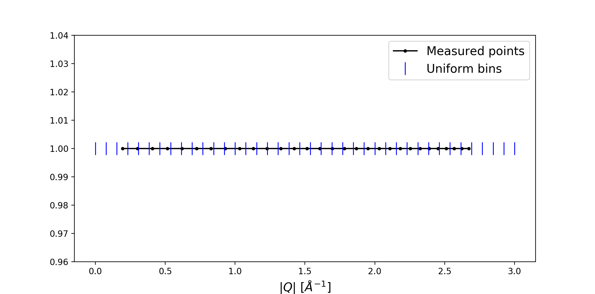

## MDHistoWorkspaces for continuous sources

### DNS at MLZ
DNS (https://mlz-garching.de/dns) is a versatile diffuse scattering cold neutron spectrometer with polarisation analysis. It can be operated in both, time-of-flight and diffraction mode. 

Since DNS detector bank is rotated during the measurements, Workspace2D is not suitable to keep the DNS data. Scanning workspaces are not suitable for Single Crystal Diffraction (SCD) data, since at least 3 dimentions (H, K, L) are required. Hence, the universal solution would be to keep the DNS data in MDHistoWorkspaces. 

Implementation of LoadDNSSCD algorithm for DNS single crystal data reduction has shown, that MDHistoWorkspaces accelerate data reduction a lot (by factor of 1000), make it more transparent and robust. The example data reduction script and a test dataset are available at (https://github.com/mantidproject/mantid/pull/22095).

The disadvantage of the MDHistoWorkspaces is that obly the uniform binning is supported. This causes problem with diffraction-mode (e.g. non-TOF) data. The image below illustrates this problem. Points show the measured points and the blue stripes show the uniform bins.

As one can see, the uniform binning for these data causes loss of the resolution.
